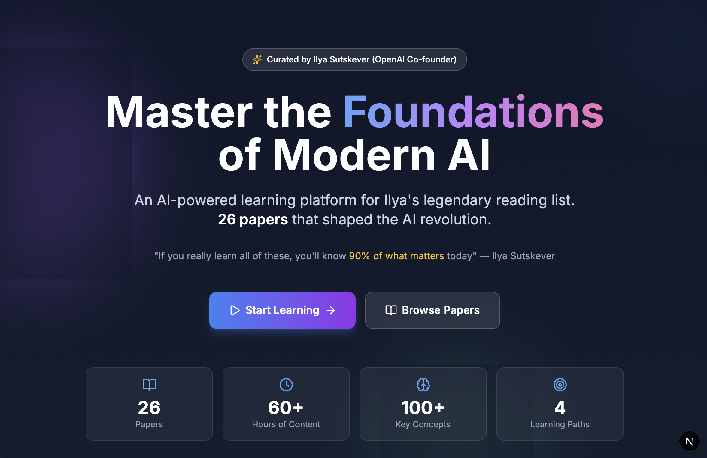
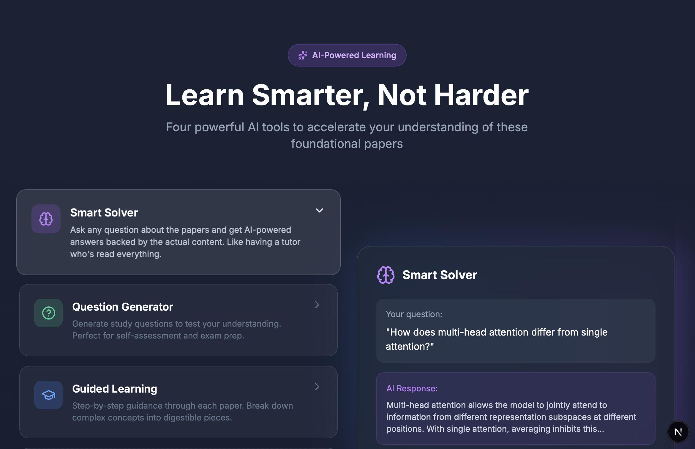
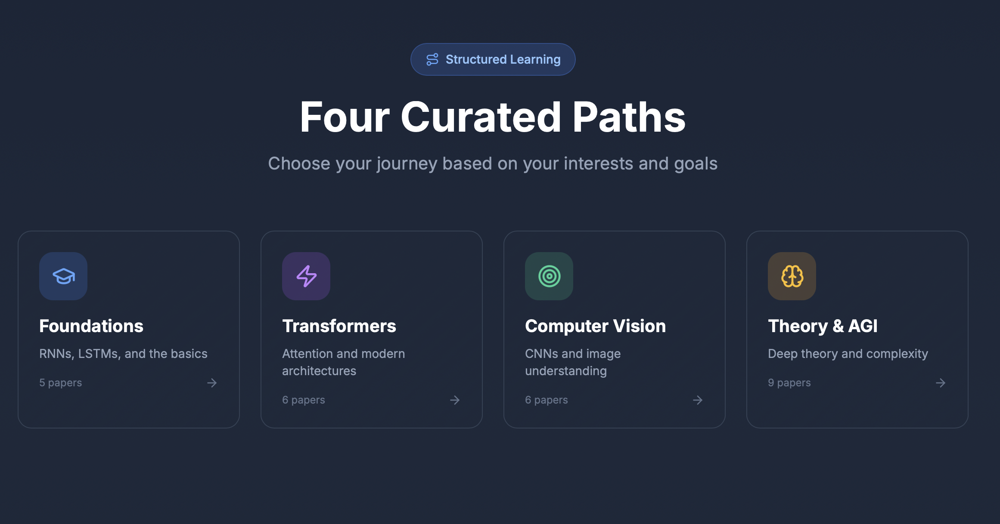
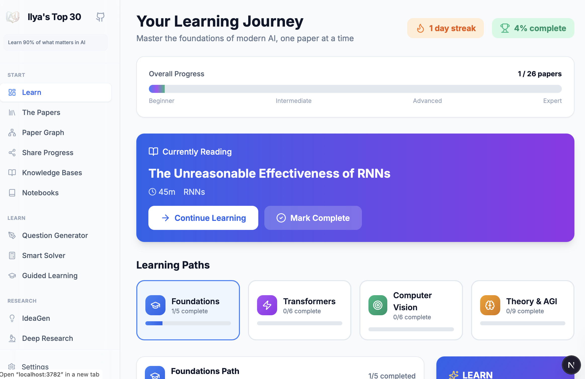
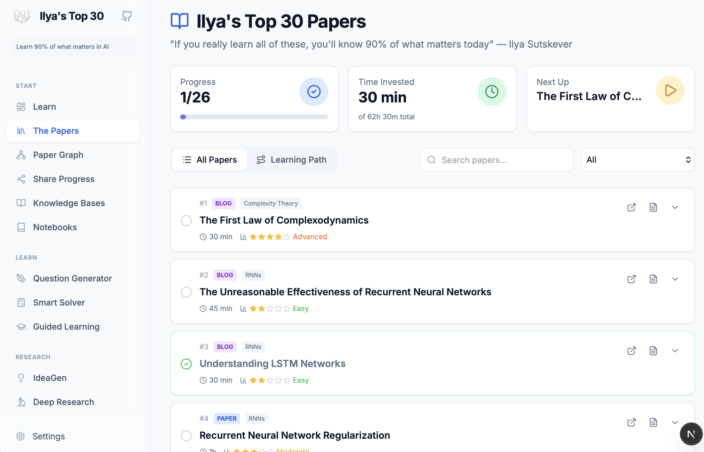

<div align="center">

# Ilya's Top 30

### AI-Powered Learning Platform for the Legendary AI Paper Reading List

[](https://nextjs.org/)
[](https://react.dev/)
[](https://www.python.org/)
[](https://fastapi.tiangolo.com/)
[](https://tailwindcss.com/)

<br />

> *"If you really learn all of these, you'll know 90% of what matters today."*
>
> **— Ilya Sutskever**, Co-founder of OpenAI

<br />

[**Live Demo**](#) · [**Features**](#features) · [**Quick Start**](#quick-start) · [**Tech Stack**](#tech-stack)

</div>

---

## What is this?

**Ilya's Top 30** is an interactive learning platform built around Ilya Sutskever's famous reading list — a curated collection of 26 papers and resources that form the intellectual foundation of modern AI.

The problem with reading academic papers? It's hard. There's no structure, no guidance, and it's easy to get overwhelmed.

This platform solves that with:
- **Structured learning paths** instead of a random list
- **AI-powered tools** to help you understand complex concepts
- **Gamification** to keep you motivated
- **Progress tracking** to see how far you've come

---

## Features

### 📚 Four Curated Learning Paths

Don't know where to start? Follow structured tracks based on your interests:

| Path | Papers | Focus |
|------|--------|-------|
| **Foundations** | 5 | RNNs, LSTMs, sequence modeling basics |
| **Transformers** | 6 | Attention mechanisms, the Transformer architecture |
| **Computer Vision** | 6 | CNNs, ResNet, image understanding |
| **Theory & AGI** | 9 | Complexity theory, scaling laws, superintelligence |

### 🤖 AI-Powered Learning Tools

#### Smart Solver
Ask any question about the papers and get AI-powered answers grounded in the actual content. The knowledge base is built from the papers themselves using RAG (Retrieval-Augmented Generation).

#### Question Generator
Generate study questions to test your understanding. Perfect for self-assessment before moving to the next paper.

#### Guided Learning
Step-by-step guidance through each paper:
1. Read the Abstract
2. Understand the Problem
3. Key Contributions
4. Method Overview
5. Results & Implications

### 🎮 Gamification

- **Progress Tracking** — See your completion percentage across all papers
- **Study Streaks** — Build consistency with daily learning streaks
- **Achievements** — Unlock badges as you hit milestones
- **Shareable Cards** — Generate beautiful progress cards to share your journey

### 📊 Interactive Paper Graph

Visualize how the 26 papers connect to each other. Understand prerequisites at a glance and see the intellectual lineage of modern AI.

### 🎨 Beautiful UI

- Dark mode support
- Fully responsive (mobile, tablet, desktop)
- Smooth animations and transitions
- Confetti celebrations when you complete papers 🎉

---

## Screenshots

### Landing Page


### AI-Powered Learning Tools


### Four Curated Learning Paths


### Learning Dashboard


### Papers List


---

## The Papers

The complete list includes foundational works like:

- **Attention Is All You Need** — The Transformer paper (foundation of GPT, Claude, etc.)
- **Deep Residual Learning (ResNet)** — Skip connections that enabled training 100+ layer networks
- **Scaling Laws for Neural Language Models** — Why bigger models work better
- **ImageNet Classification (AlexNet)** — The paper that started the deep learning revolution
- **Neural Machine Translation (Bahdanau Attention)** — The attention mechanism
- **Understanding LSTM Networks** — Chris Olah's visual explanation of LSTMs
- And 20 more...

[View the full list →](data/papers/ilya_top_30.json)

---

## Quick Start

### Prerequisites

- Python 3.12+
- Node.js 18+
- An LLM provider (OpenAI, Ollama, or LM Studio)

### Installation

```bash
# Clone the repo
git clone https://github.com/jhammant/ilya-top-30.git
cd ilya-top-30

# Set up Python environment
python3.12 -m venv venv
source venv/bin/activate
pip install -r requirements.txt

# Set up frontend
cd web
npm install
cd ..

# Configure environment
cp .env.example .env
# Edit .env with your LLM settings (see below)
```

### Configuration

Edit `.env` to configure your LLM provider:

**Option 1: OpenAI**
```env
LLM_BINDING=openai
LLM_HOST=https://api.openai.com/v1
LLM_MODEL=gpt-4o
LLM_API_KEY=sk-your-key-here
```

**Option 2: Local with Ollama**
```env
LLM_BINDING=ollama
LLM_HOST=http://localhost:11434/v1/
LLM_MODEL=llama3.2
LLM_API_KEY=ollama
```

**Option 3: Local with LM Studio**
```env
LLM_BINDING=openai
LLM_HOST=http://localhost:1234/v1
LLM_MODEL=local-model
LLM_API_KEY=lm-studio
```

### Run

```bash
# Start both backend and frontend
source venv/bin/activate
python scripts/start_web.py

# Open in browser
# Frontend: http://localhost:3782
# Backend API: http://localhost:8001/docs
```

---

## Tech Stack

| Layer | Technology |
|-------|------------|
| **Frontend** | Next.js 16, React 19, TailwindCSS |
| **Backend** | Python 3.12, FastAPI |
| **RAG Engine** | LightRAG (knowledge graph-based retrieval) |
| **LLM Support** | OpenAI, Ollama, LM Studio |
| **Database** | SQLite (local), PostgreSQL (production) |

---

## Roadmap

- [ ] User authentication (Clerk/NextAuth)
- [ ] Cloud database for multi-user progress
- [ ] Spaced repetition for review scheduling
- [ ] Discussion forums per paper
- [ ] Mobile app (React Native)
- [ ] More paper collections beyond Ilya's list

---

## Contributing

Contributions are welcome! Please feel free to submit a Pull Request.

---

## Credits

- **Paper list** curated by [Ilya Sutskever](https://en.wikipedia.org/wiki/Ilya_Sutskever)
- **Built on** [DeepTutor](https://github.com/HKUDS/DeepTutor) by HKUDS
- **Built with** [Claude Code](https://claude.ai/code)

---

## License

This project is licensed under the AGPL-3.0 License - see the [LICENSE](LICENSE) file for details.

---

<div align="center">

**Start your journey to mastering the foundations of modern AI.**

[Get Started →](http://localhost:3782/welcome)

</div>
